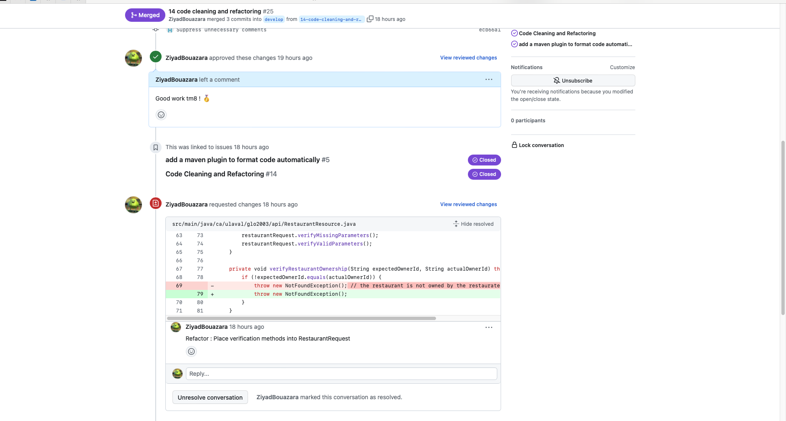

# Exercices - TP1

## Convention de Commits
**Sources** : [Conventional Commits](https://www.conventionalcommits.org/) et [Angular Git Commit Guidelines](https://github.com/angular/angular/blob/master/CONTRIBUTING.md#-commit-message-guidelines)

### Nommer les Commits

Les commits sont nommés selon la structure suivante : `<type>: <description>`. Nous utilisons les types de commits suivants :

- `feat`: Nouvelle fonctionnalité ajoutée.
- `fix`: Correction d'un bug.
- `docs`: Mise à jour de la documentation.
- `chore`: Tâches de maintenance ou amélioration des outils.
- `style`: Modifications liées au style du code (formatage, indentation, etc.).
- `test`: Ajout ou modification de tests.
- `refactor`: Restructuration du code sans changer son comportement.
- `ci`: Modifications liées aux configurations ou scripts de CI/CD.

Exemple de commit : `feat: Ajout d'une fonctionnalité de connexion`


### Quoi et Quand Commiter

#### Quoi Commiter?

1. **Commits Atomiques :** Chaque commit doit représenter une seule unité logique de changement. Il est acceptable de faire des commits de travaux 
incomplets pour une meilleure collaboration.

#### Quand Commiter?

1. **Commit Régulièrement :** Faire des commits réguliers pour capturer l'évolution du code au fil du temps.
2. **À l'atteinte d'étapes logiques :** Commiter lorsqu'une étape logique ou fonctionnalité est completée.
3. **Avant de changer de tâche :** Commiter avant de passer à une nouvelle tâche pour isoler les changements.


---

## Stratégie de Branching Gitflow

**Source:** [Atlassian Gitflow Workflow](https://www.atlassian.com/git/tutorials/comparing-workflows/gitflow-workflow)

### 1. Quelles sont les branches *de base* (qui sont communes et qui existeront toujours) et quels sont leurs rôles (chacune)?

- **`main` (ou `master`):**
    - *Rôle:* C'est la branche principale du projet.
    - *Utilisation:* Contient le code officiellement intégré et pouvant être déployé en production.

- **`develop`:**
    - *Rôle:* Branche de développement continue.
    - *Utilisation:* Intègre les fonctionnalités complètes et testées avant de les fusionner dans `main`. Utile pour tester des fonctionnalités de manière groupée.

### 2. Quelle branche est *LA* branche principale (contenant le code officiellement intégré et pouvant être remis)?

**`main`:**
- *Rôle:* C'est la branche principale du projet.
- *Utilisation:* Contient le code officiellement intégré et pouvant être déployé en production. 
C'est la branche à partir de laquelle `develop` est créé et fusionnée.

### 3. Quand créer une nouvelle branche?

Créez une nouvelle branche dans les situations suivantes :
- Pour développer une nouvelle fonctionnalité. L'issue doit avoir le tag `feature`.
- Pour corriger un bug. L'issue doit avoir le tag `fix`.

### 4. Quand faire une demande de changement / d'intégration (pull request / merge request) et sur quelle branche la faire?

Faites une demande de pull request lorsque vous avez terminé le développement sur une branche spécifique. La branche de destination pour la PR dépend du type de branche, mais elle peut être `develop` ou `main`, en fonction de votre processus d'intégration. 

### 5. Exemple de Flow complet
```
git checkout develop
git checkout -b feature_branch
# work happens on feature branch
git checkout develop
git merge feature_branch
git checkout main
git merge develop
git branch -d feature_branch # always delete your feature branches when you're done!
```

### 6. Convention de nomenclature des branches

La branche de feature doit être nommée selon la convention suivante :

1. Si la branche ferme/concerne une seule issue, le nom de la branche doit être formé en utilisant le numéro de l'issue suivi du nom de l'issue, séparés par un tiret. Par exemple :
   `<numéro_de_l'issue>-<nom_de_l'issue>`
   Exemple :
   `11-code-cleaning-and-refactoring`

2. Si la branche ferme/concerne plusieurs issues, le nom de la branche doit décrire de manière générale les améliorations apportées par la branche. Par exemple :
   `code-cleaning-and-refactoring-correction-and-improvements`. Dans ce cas, il sera important de tag toutes les issues fermées par cette branche dans la PR.

En suivant cette convention, il est plus facile de comprendre le contenu et le contexte des branches de feature, ce qui facilite la gestion et la collaboration sur le projet.

## GitHub Project

## Milestone

## Issues


## Pull Requests
### PR1


### PR2


### PR3


## Arbre de Commits


## Clean Code

### Noms de variables, de méthodes et de classes.
- Les noms de variables et de méthodes doivent obligatoirement être en anglais.
- Les noms de méthodes doivent être en Camel Case.
    
        Exemple: Int calculateDonuts()
- Les noms de méthodes doivent commencer avec un verbe.
- Les noms de variables doivent être en Camel Case.
    
        Exemple:  Int numberOfDonuts
- Les noms de classes doivent être en Pascal Case.
    
        Exemple:  class Donut()

### Règles générales concernant le clean code
**Source:** [GitHub Clean Code Repo](https://gist.github.com/wojteklu/73c6914cc446146b8b533c0988cf8d29#)
- Garder le code simple et les fonctions courtes et uniformes.
- Nettoyer le code à chaque commit pour le laisser toujours plus propre qu'il a été trouvé.
- Suivre la [loi de Demeter](https://www.dotnetdojo.com/loi-de-demeter/) concernant les classes.
- Éviter les commentaires au maximum, le code devrait s'expliquer de lui-même et être auto-portant.
