# Exercices - TP2

## GitHub Project
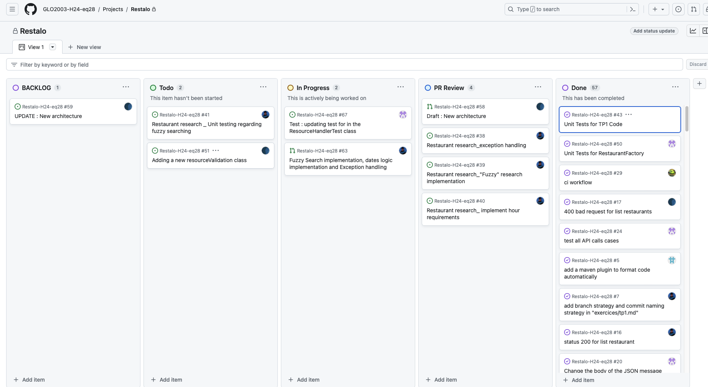
## Milestone
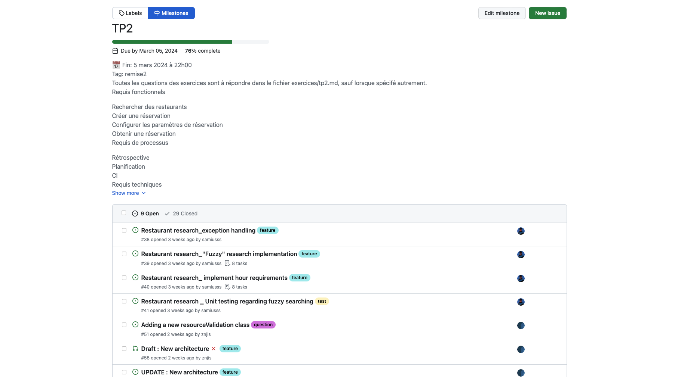
## Issues
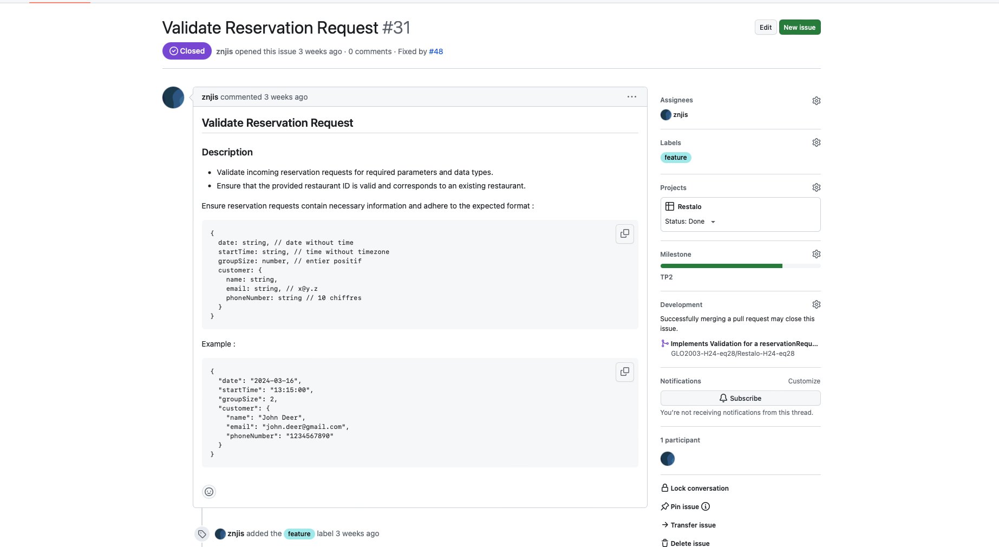
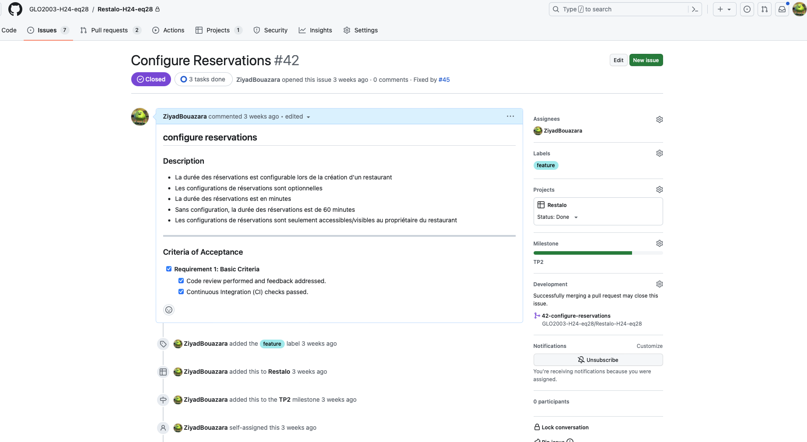
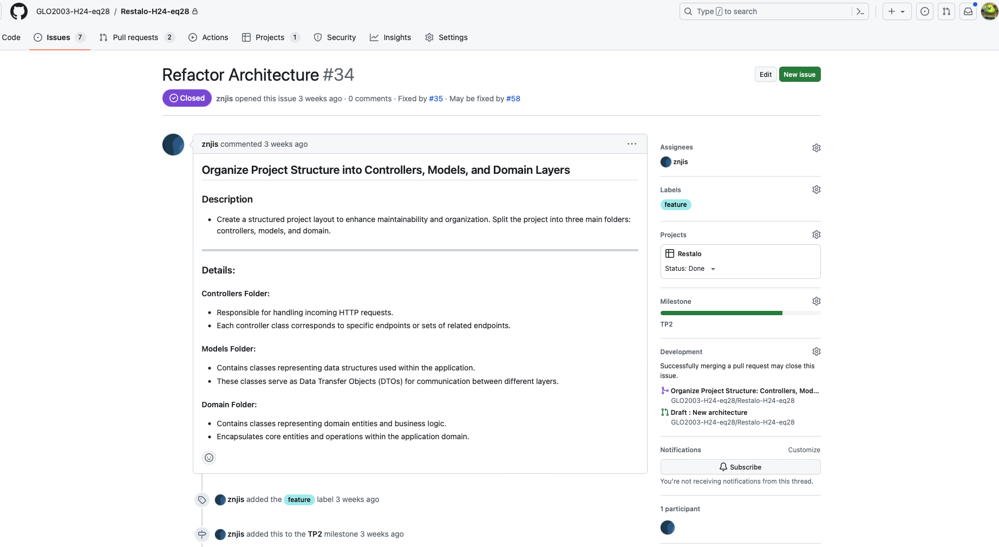

## Pull Requests
### PR1
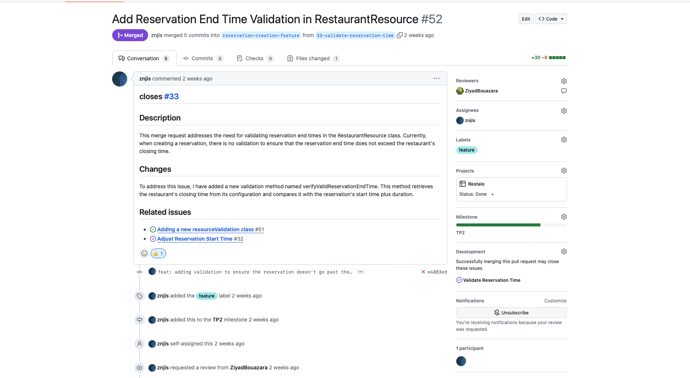
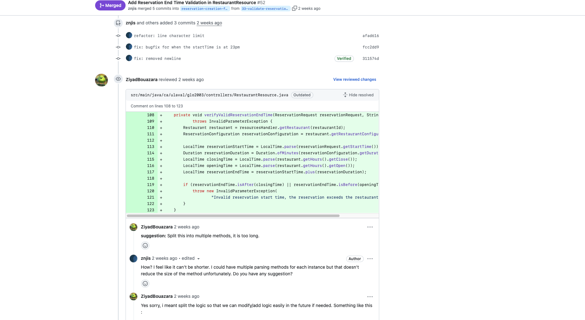
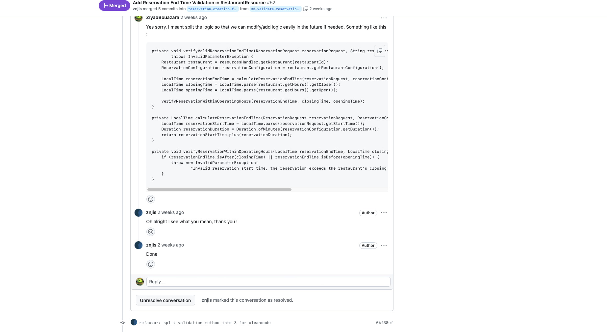

### PR2
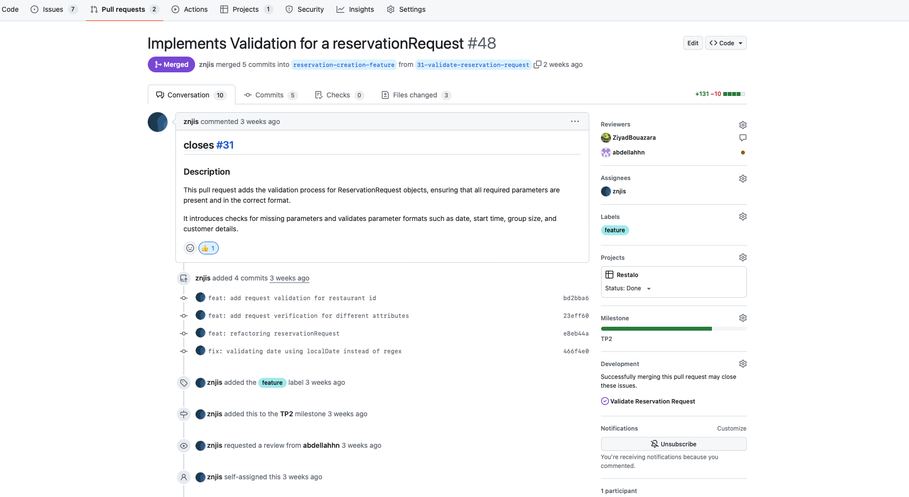
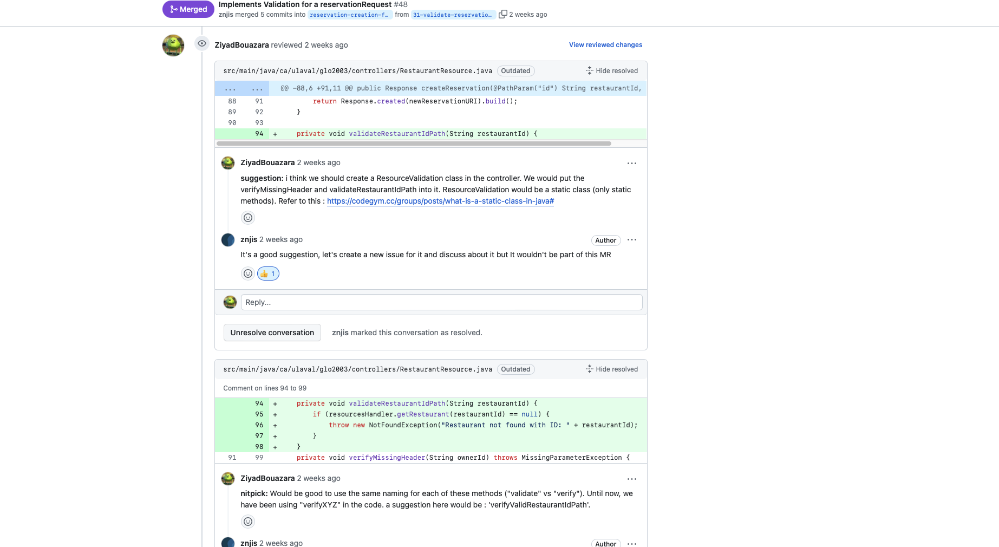
### PR3
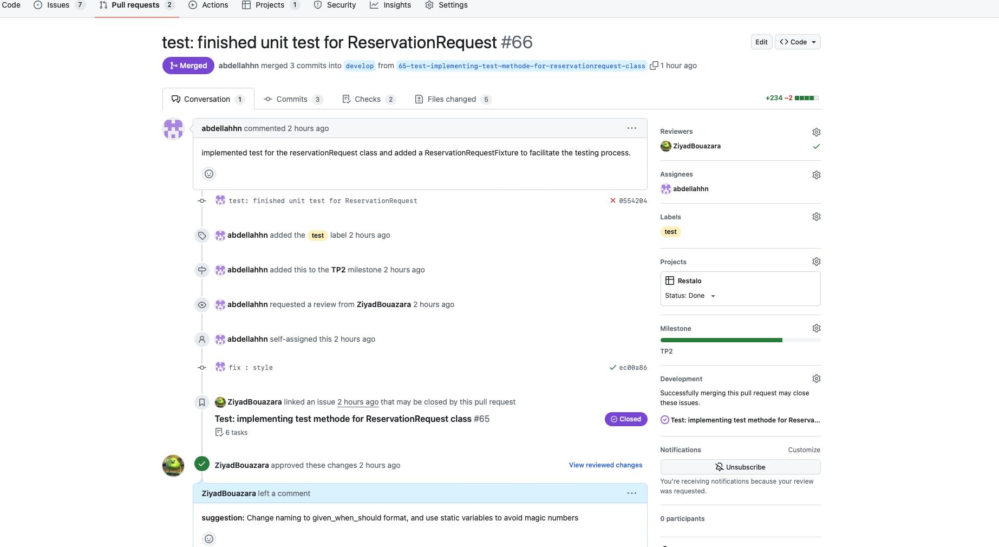

## Arbre de Commits
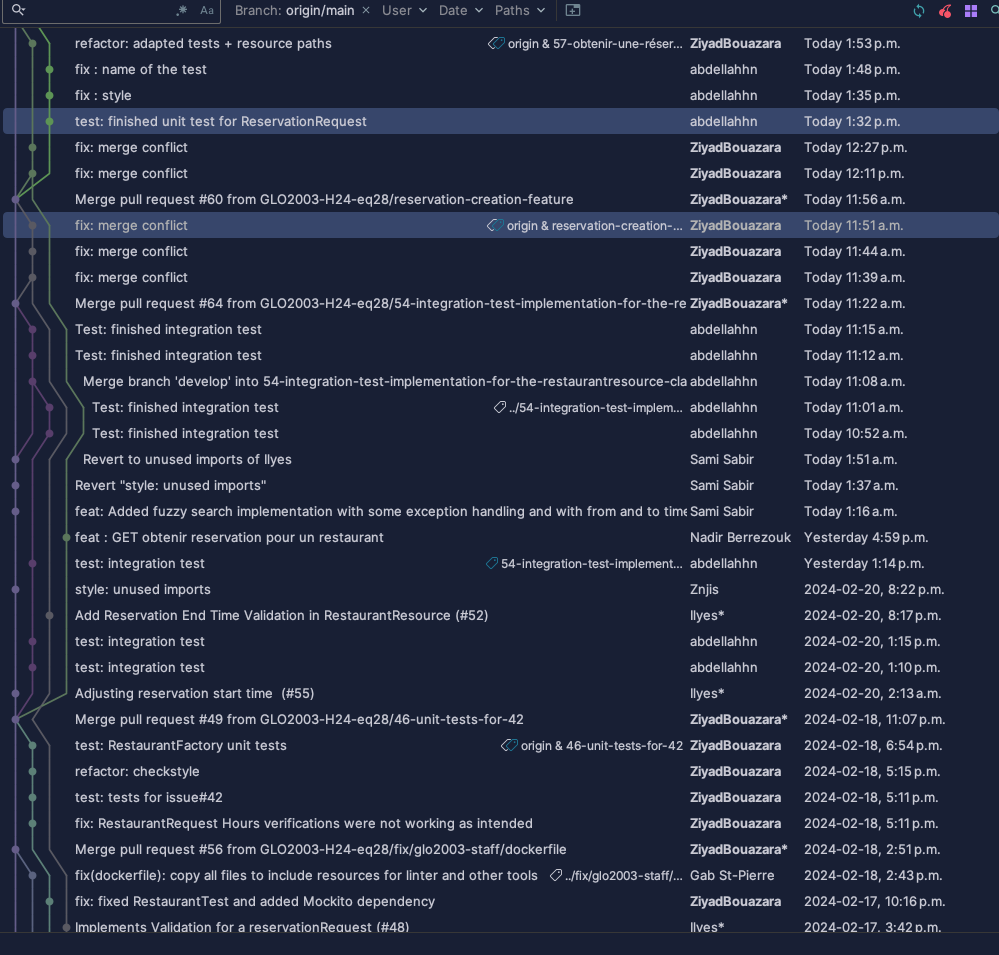
## Rétrospective sur le processus

### Mesure des métrique du processus:

#### Temps pour implémenter une issue:

Les commits sont nommés selon la structure suivante : `<type>: <description>`. Nous utilisons les types de commits suivants :

#### Temps pour intégrer une pull request:

Les commits sont nommés selon la structure suivante : `<type>: <description>`. Nous utilisons les types de commits suivants :

#### Nombres de personnes qui travaillaient sur chaques issues:

Les commits sont nommés selon la structure suivante : `<type>: <description>`. Nous utilisons les types de commits suivants :

#### Nombres de personnes qui reviwaient chaques pull-request:

Les commits sont nommés selon la structure suivante : `<type>: <description>`. Nous utilisons les types de commits suivants :

#### Nombres d'issues qui étaient en cours d'implémentation en même temps:

Les commits sont nommés selon la structure suivante : `<type>: <description>`. Nous utilisons les types de commits suivants :

#### Nombres de pull-requests qui étaient en cours review en même temps:

Les commits sont nommés selon la structure suivante : `<type>: <description>`. Nous utilisons les types de commits suivants :

### Réflexions à faire en équipe sur le processus:

1. lol.
2. lol.
3. lol.

