# Exercices - TP3

# Planification

## GitHub Project

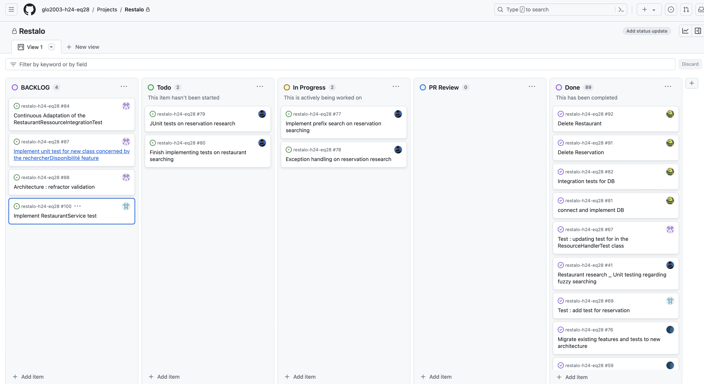

## Milestone

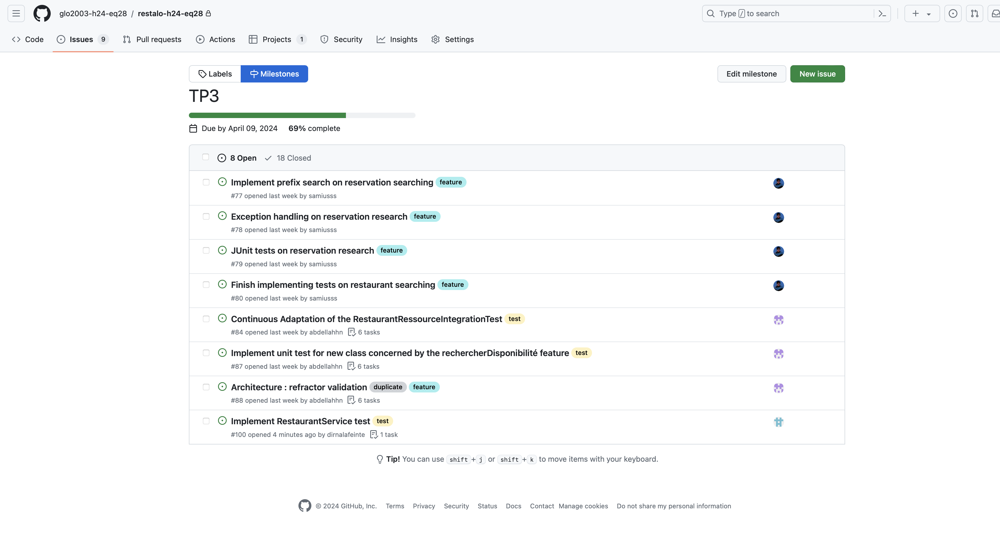

## Issues

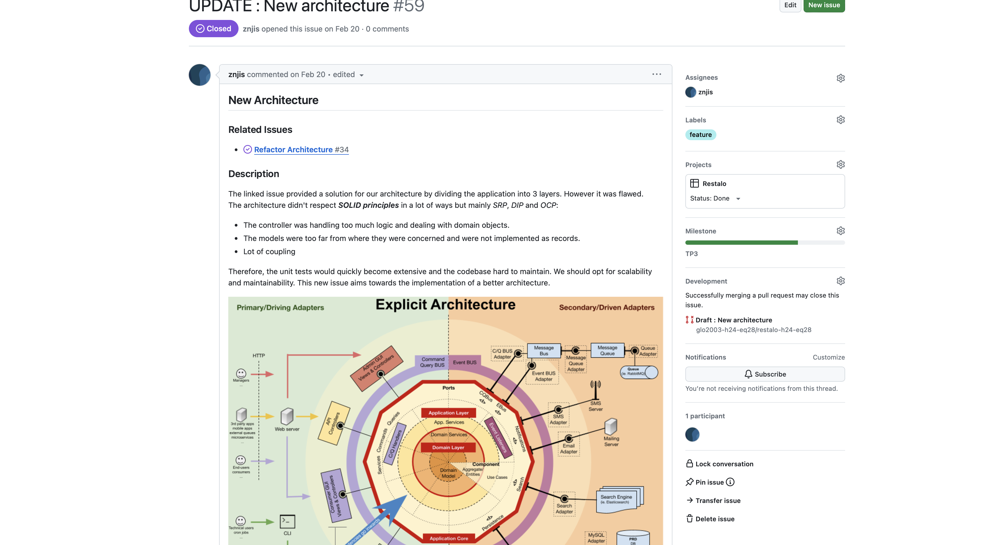
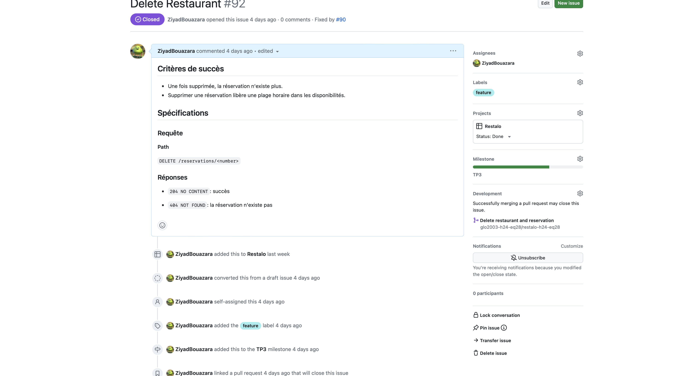
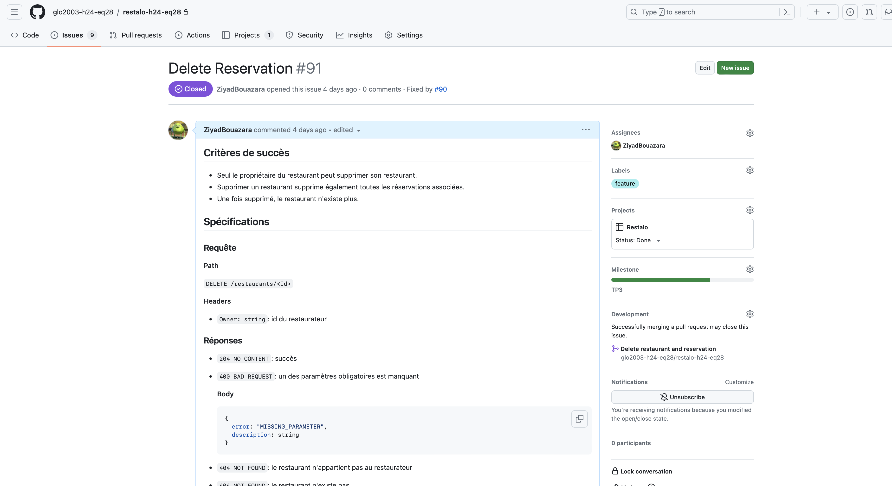

## Pull Requests

### PR1

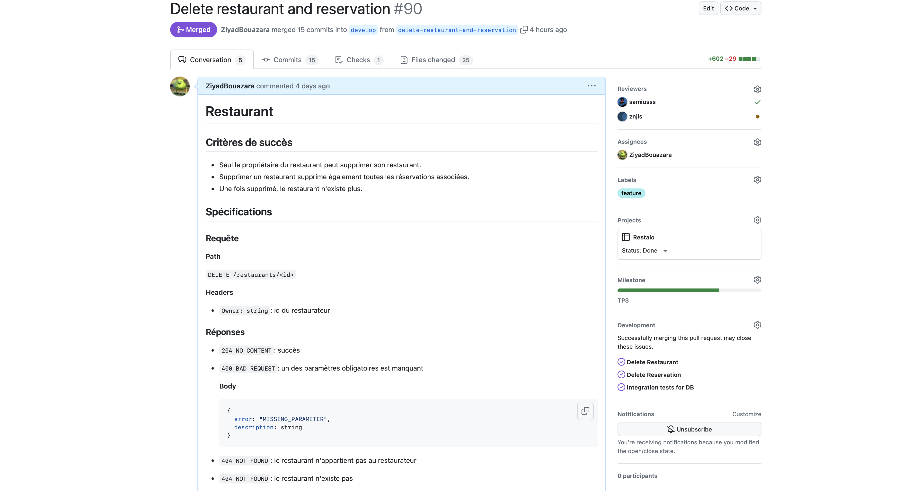
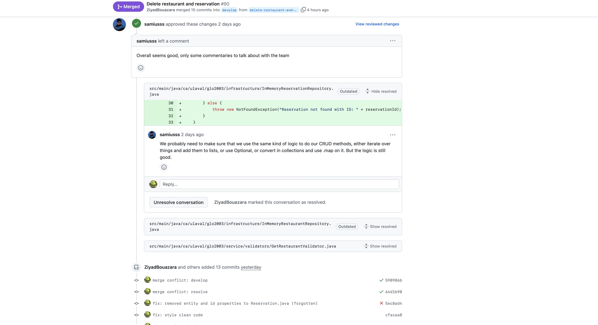

### PR2

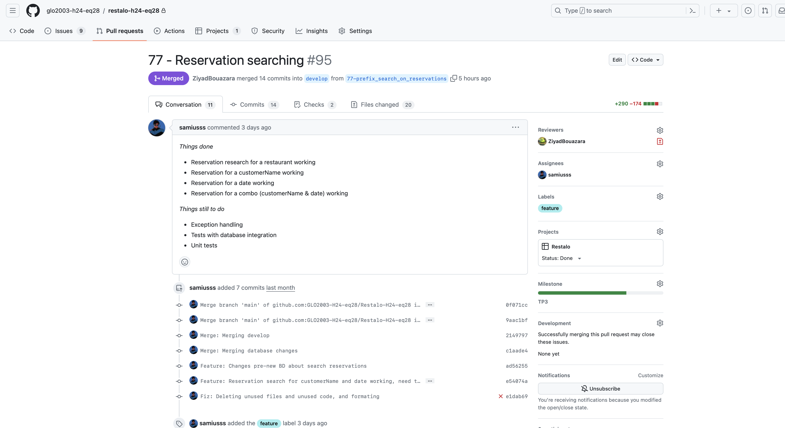
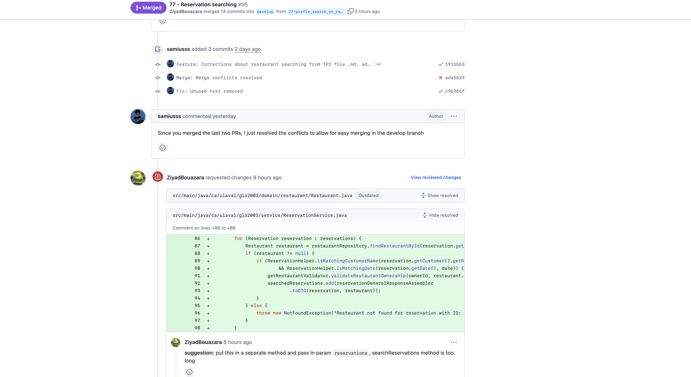

### PR3

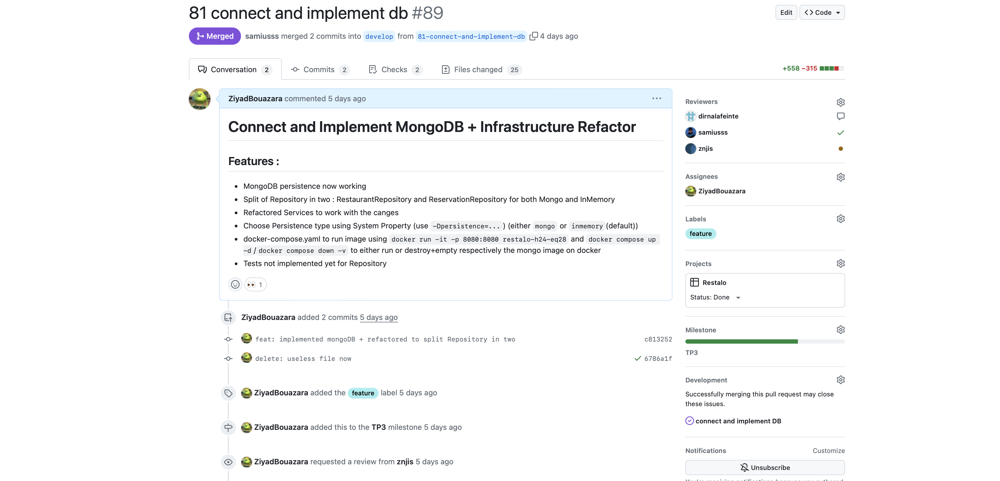
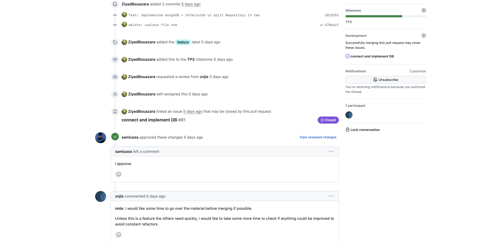

## Arbre de Commits

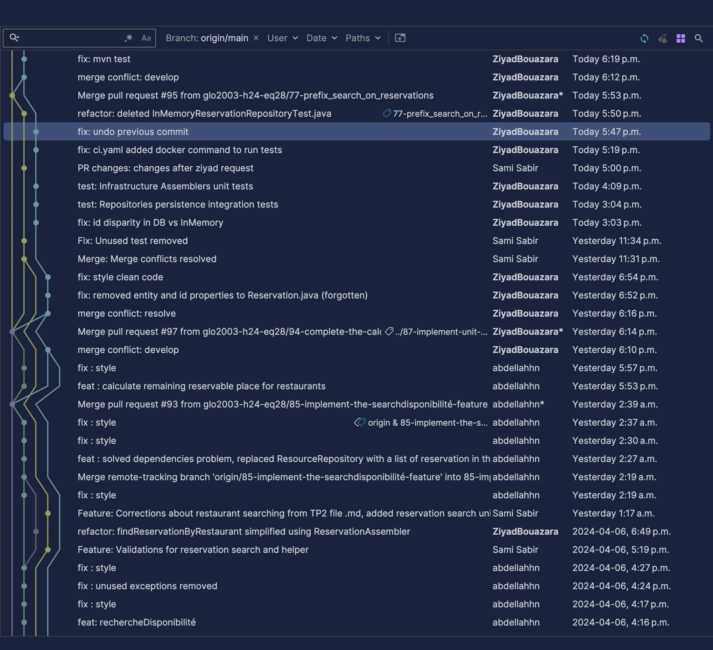

# Rétrospective - Intégration continue et tests

### Pipeline CI

#### 1. Temps passé à vérifier et tester manuellement le code avant l'implémentation du pipeline de tests automatisés :

Avant l'implémentation du pipeline de tests automatisés, nous estimions le temps passé à vérifier et tester manuellement
le code entre une heure et deux heures. Ce temps était souvent consacré à des activités telles que l'exécution de
scénarios de test, la vérification de la conformité aux spécifications, la saisie de données de test et l'analyse des
résultats. Cette estimation incluait également le temps nécessaire pour répéter ces étapes en cas d'erreurs ou de bugs
détectés lors des tests manuels.

#### 2. Temps passé à faire les vérifications après l'implémentation du CI :

Après l'implémentation du CI, le temps passé à faire les vérifications a été significativement réduit. Avec la
vérification automatisée du formatage, de la compilation et des tests à chaque intégration de code, le processus de
validation est devenu plus rapide et plus efficace. En moyenne, nous constatons que les vérifications nécessitent
maintenant généralement quelques minutes seulement.

#### 3. Points positifs apportés par le CI à notre processus :

1. Gain de temps : Le CI automatise les tâches répétitives et réduit le temps nécessaire pour valider chaque
   modification de code. Avec l'automatisation des étapes telles que la vérification du formatage, la compilation et les
   tests, nous gagnons des heures précieuses auparavant consacrées à des tâches manuelles.

2. Amélioration de la qualité du code : Le CI contribue à une amélioration constante de la qualité du code en détectant
   rapidement les erreurs et les problèmes potentiels. En exécutant des tests à chaque intégration de code, il permet
   d'identifier et de corriger les bugs plus tôt dans le processus de développement, réduisant ainsi les risques
   d'anomalies dans le produit final.

3. Meilleure fiabilité : Le CI garantit une plus grande fiabilité du processus de déploiement en automatisant les étapes
   de vérification et de test. En s'assurant que chaque modification de code est soumise à un ensemble complet de tests,
   il réduit les risques d'introduire des erreurs dans les versions livrées aux utilisateurs.

#### 4. Inconvénients potentiels du pipeline CI et leurs impacts sur le processus, le produit et/ou l'équipe :

1. Fragilité:
    - Impact sur le processus: Le pipeline peut être sensible aux changements dans l'environnement de
      développement, ce qui
      peut le rendre fragile et sujet à des pannes.
    - Impact sur le produit: Des pannes du pipeline peuvent retarder la livraison du produit et affecter sa qualité.
    - Impact sur l'équipe: L'équipe peut être amenée à passer du temps à déboguer et à réparer le pipeline au lieu de se
      concentrer sur le développement du produit.
2. Complexité accrue:

    - Impact sur le processus: Augmentation du temps de configuration et de maintenance du pipeline. Nécessite une
      expertise
      technique pour la gestion et la résolution des problèmes.
    - Impact sur le produit: Risque accru d'erreurs et de bugs dans le pipeline, pouvant affecter la qualité du produit
      final.
    - Impact sur l'équipe: Nécessite une formation et un investissement en temps pour l'équipe afin de comprendre et d'
      utiliser le pipeline.

### Tests

#### 1. Proportion du temps consacré à l'implémentation du code fonctionnel par rapport aux tests et son évolution au fil du temps :

On passe environ 70 % du temps à implémenter le code fonctionnel et 30 % à écrire des tests. Cette proportion évolue au
fil du temps, avec une tendance à augmenter la part des tests. Cela est dû à plusieurs facteurs :

Prise de conscience de l'importance des tests: On a compris que les tests sont essentiels pour garantir la qualité et la
robustesse du code.

On constate donc une transition vers une proportion plus équilibrée entre l'implémentation du code
fonctionnel et l'écriture des tests, voire une augmentation de la part des tests au fil du temps. Cela reflète une
évolution positive vers des pratiques de développement plus rigoureuses et orientées vers la qualité.

#### 2. Impact de l'implémentation de tests sur la charge de travail et son effet sur le processus :

L'implémentation de tests a naturellement augmenté la charge de travail. Cela a eu un impact sur notre processus de
développement de plusieurs manières :

- Augmentation de la taille des issues/PRs: Les issues et les pull requests (PRs) incluent désormais non seulement le
  code
  fonctionnel, mais aussi les tests associés.

- Allongement du temps d'implémentation: Le temps nécessaire à l'implémentation d'une fonctionnalité est désormais plus
  long car il faut également écrire les tests.

- Planification plus rigoureuse: Il est important de planifier les tests en amont afin de garantir qu'ils couvrent tous
  les aspects de la fonctionnalité.

#### 3. Niveau de confiance dans le code suite à l'implémentation de tests :

Nous avons plus confiance en notre code maintenant que on a des tests. Les tests nous permettent de nous assurer que le
code
fonctionne comme prévu et qu'il est robuste face aux erreurs. En plus, nous avons la confirmation que les ajouts de
nouvelles feature ou simplement le code que l'on rajoute n'introduit pas de bris aux features précédentes. Cela nous
donne la tranquillité d'esprit de savoir que le
code est moins susceptible de causer des problèmes.

#### 4. Stratégies pour améliorer l'état des tests :

- Écrire plus de tests: Il est important d'avoir un bon niveau de couverture de test pour garantir la qualité du code.
- Améliorer la qualité des tests: Les tests doivent être bien écrits et faciles à comprendre. Ils doivent également être
  pertinents et tester les aspects importants de la fonctionnalité.
- Ajouter des métriques de tests: ajouter des outils de calcul de coverage et ajouter une étape à notre CI pour vérifier
  qu'un minimum de coverage (par exemple: 80%) est respecté pour qu'il réussise. Il est également important de suivre
  les
  métriques de test et de les analyser
  régulièrement. Cela permet d'identifier les points faibles de la couverture de test et de prendre les mesures
  nécessaires pour les
  améliorer. On pourrait également analyser le temps d'exécution des tests en surveillant la durée nécessaire pour
  exécuter l'ensemble des tests. Une augmentation significative du temps d'exécution peut indiquer des problèmes de
  performance ou une surcharge de tests. En effet, dans notre cas, l'ajout des tests d'intégration de la persistence
  avec des Testcontainer a considérablement augmenté le runtime de nos tests. Une solution serait de créer et utiliser
  le même container mais en rafraichissant la DB en droppant la table.

## Architecture

### Rôles des classes principales

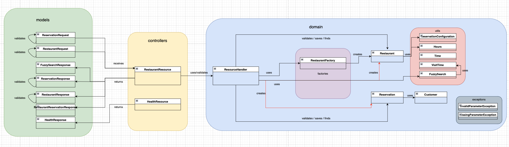

- ReservationConfiguration : Permet de configurer une réservation pour un restaurant. Cela permet de définir le nombre
  de places disponibles, le temps de réservation minimum et le temps de réservation maximum.
- ReservationRequest : Permet de faire une requête pour la réservation d'un restaurant.
- RestaurantRequest : Permet de faire une requête pour la création d'un restaurant.
- RestaurantService/ReservationService : Fait le pont entre les Resources et le Domaine en utilisant les Factories,
  Assemblers et Validators pour Sauvegarder et Rechercher.
- Restaurant : Permet de créer un restaurant et d'avoir accès à ses attributs.
- Reservation : Permet de créer une réservation et d'avoir accès à ses attributs.
- RestaurantMongo : Objet desérializable de Restaurant qui est stocké dans la MongoDB.
- ReservationMongo : Objet desérializable de Reservation qui est stocké dans la MongoDB
- RestaurantResource/ReservationResource : Permet de gérer les requêtes pour les restaurants/reservations.
- InvalidParamExceptionMapper : Permet de gérer les exceptions InvalidParamException.
- MissingParamExceptionMapper : Permet de gérer les exceptions MissingParamException.
- NotFoundExceptionMapper : Permet de gérer les exceptions NotFoundException.
- Main : Permet de démarrer le serveur.
- FuzzySearch : Permet d'avoir l'objet de recherche de Restaurant à travers lequel on peut rechercher un restaurant par
  son nom, par l'heure à laquelle il est possible d'y aller et l'heure de départ.
  Utiliser une classe comme ceci permet une recherche plus flexible.
- Availabilities: Disponibilités d'un restaurant
- VisitTime: Représente le temps auquel un client peut aller au restaurant et en repartir. C'est pour cette raison que
  cette classe contient un from et un to.
- ...Response : Copie d'un objet complexe qui est retourné à l'utilisateur (DTO)

### Nos choix

Notre architecture repose sur deux entités principales : Restaurant et Réservation. Ce choix est motivé par les raisons
suivantes :

Centralité des concepts: Les restaurants et les réservations sont les deux concepts centraux de notre application. La
plupart des fonctionnalités de l'application tournent autour de ces deux concepts.
Cohésion: Chaque entité regroupe des fonctionnalités et des données qui lui sont propres. Cela permet d'assurer une
meilleure cohésion et une meilleure modularité du code.
Simplicité: Cette architecture est simple et facile à comprendre. Cela facilite la maintenance et l'évolution de l'
application.

**Structure des packages:**

L'architecture est divisée en quatre packages :

- Controllers: Ce package contient les contrôleurs qui gèrent les interactions avec l'interface utilisateur.
- Service: Ce package contient les services qui implémentent la logique métier.
- Domain: Ce package contient les modèles de domaine qui représentent les données de l'application.
- Infrastructure: Ce package contient les classes qui dépendent de l'environnement d'exécution, telles que les accès aux
  bases de données.

Avantages de cette architecture:

- Modularité: L'architecture est modulaire et chaque package est indépendant des autres. Cela facilite la maintenance et
  l'évolution de l'application.
- Couplage faible: Le couplage entre les packages est faible. Cela permet de modifier un package sans affecter les
  autres.
- Testabilité: L'architecture est facile à tester car chaque package est indépendant des autres.
- Extensibilité: L'architecture est extensible et il est facile d'ajouter de nouvelles fonctionnalités.

### Relations  suspectes et des solutions potentielles

Dans notre architecture actuelle, chaque service possède les deux repositories (Restaurant et Réservation) au lieu de
posséder seulement celui de son entité. Cela peut sembler suspect et contrevenir aux principes de conception SOLID.

**Justification:**

Cette architecture est due à la forte relation entre les entités Restaurant et Réservation. Elles sont liées par des
références mutuelles:

Un restaurant peut avoir plusieurs réservations.
Une réservation est liée à un seul restaurant.

**Conséquences:**

Certaines opérations sur une entité nécessitent l'accès à l'autre entité:

- Suppression d'un restaurant: Lors de la suppression d'un restaurant, il est nécessaire de supprimer également ses
  réservations associées. Cela implique l'accès au repository Réservation depuis le service Restaurant.

**Solutions potentielles:**

**1. Refactoring du code:**

- Déplacer les repositories dans un module séparé partagé par les services Restaurant et Réservation.
- Adapter les services pour utiliser le module de repositories.

**2. Implémentation d'un pattern Domain Events:**

- Définir des événements de domaine pour les modifications des entités Restaurant et Réservation.
- Enregistrer les événements de domaine dans un journal d'événements.
- Les services écoutent les événements de domaine et effectuent les mises à jour nécessaires.

# Stories

### Story 1: Créer une réservation à un restaurant

En tant que propriétaire d'un restaurant, je veux pouvoir créer une réservation pour mon restaurant 
afin de gérer les disponibilités et d'organiser les services.

***Critères d'acceptation:***
1. En tant que propriétaire, lorsque je veux créer une réservation, je dois spécifier les informations
suivantes:
   - Le id du restaurant
   - La date de la réservation
   - L'heure de début de la réservation
   - Le nombre de personnes du groupe à venir
   - Le nom de la personne qui fait la réservation
   - Le numéro de téléphone de la personne qui fait la réservation
   - L'adresse email de la personne qui fait la réservation

2. Une fois les informations saisies, le système doit vérifier si tous les paramètres suivent le bon
format et sont valides. Si un paramètre est invalide, une exception InvalidParamException doit être
renvoyée au propriétaire.

3. Si tous les paramètres sont valides, le système doit créer une réservation pour le restaurant.

4. Le système doit renvoyer un identifiant unique de la réservation au propriétaire.

***Exemple d'utilisation:***

En tant que propriétaire du restaurant "La Petite Boulangerie" (id=1234), je souhaite créer une réservation pour 
une table de quatre personnes le samedi 15 mai à 19h00 pour M. Dupont. Celui-ci me donne son numéro et mail et 
je les saisis dans le système. Ensuite je reçois un identifiant unique de réservation ce qui me confirme que la 
réservation est bien passée.

### Story 2: Rechercher une réservation

En tant que propriétaire d'un restaurant, je veux pouvoir effectuer une recherche par préfixe du nom de la personne 
qui réserve, ou par date de toutes les réservations à mes restaurants, afin de confirmer qu'un client a bien une 
réservation.

***Critères d'acceptation:***
1. En tant que propriétaire, lorsqu'un client se présente et me donne son nom ou sa date de réservation, je
dois pouvoir effectuer une recherche pour retrouver sa réservation pour chaque lettre de plus qui se rajoute
à la recherche du nom du client.

2. La recherche par nom doit être une recherche de préfixe, ce qui signifie que le système retourne toutes les 
réservations pour lesquelles le nom de la personne commence par le préfixe spécifié.

3. La recherche par date doit retourner toutes les réservations pour la date spécifiée.

4. Si aucun paramètre de recherche n'est fourni, le système retourne toutes les réservations pour tous les restaurants.

5. Si la date et le nom du client sont donnés, le système doit effectuer une recherche combinée et retourner les
réservations correspondant aux deux critères.

6. Le système doit renvoyer une liste de réservations correspondant aux critères de recherche.

7. Dans le cas où aucune reservation n'est trouvée, le système doit renvoyer une liste vide.

***Exemple d'utilisation:***
En tant que propriétaire du restaurant "Le Petit Bistro", je souhaite rechercher les réservations pour 
confirmer celles effectuées par mes clients.

#### 1. Recherche par préfixe du nom :

- **Requête :** `GET /restaurants/reservations?namePrefix=John`
- **Réponse :** La requête retourne toutes les réservations pour lesquelles le nom du client commence par "John". Cela 
permet de trouver rapidement toutes les réservations effectuées par les clients dont le nom commence par "John", 
comme "John Doe" ou "Johnny Cash".

#### 2. Recherche par date :

- **Requête :** `GET /restaurants/reservations?date=2024-04-15`
- **Réponse :** La requête retourne toutes les réservations pour la date spécifiée, par exemple le 15 avril 2024. 
Cela permet de voir toutes les réservations effectuées pour cette journée spécifique, ce qui est utile pour planifier 
le personnel et les fournitures en conséquence.

#### 3. Recherche sans paramètres :

- **Requête :** `GET /restaurants/reservations`
- **Réponse :** La requête retourne toutes les réservations pour tous les restaurants. Cela permet de consulter 
l'ensemble des réservations effectuées dans mon restaurant et de s'assurer que rien n'a été manqué.

