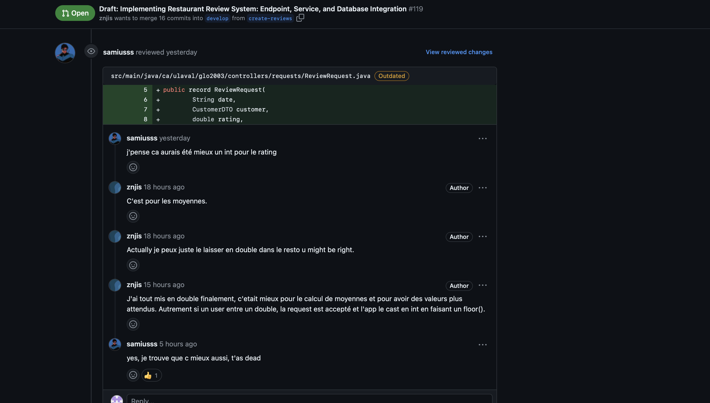
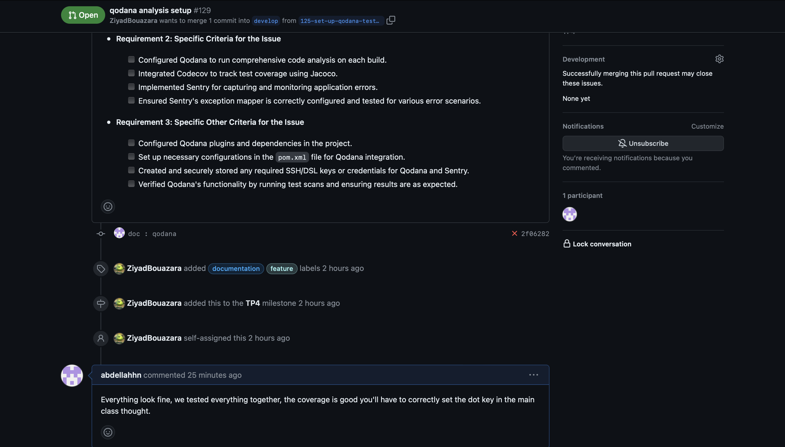

# Exercices - TP4

# Planification

## GitHub Project

## Milestone

## Issues

## Pull Requests

### PR1

### PR2

### PR3

## Arbre de Commits

# 1.Outils d'analyses de code (SCA)

## La qualité du code (clean code, bogues potentiels, optimisations, meilleures pratiques, etc.)
Pour garantir la qualité du code, nous avons utilisé l'outil Qodana, intégré avec IntelliJ IDEA, pour effectuer une analyse approfondie du code source. Qodana nous permet de détecter les problèmes potentiels, les violations des bonnes pratiques de codage, et d'appliquer des normes de qualité élevées à notre codebase. En intégrant Qodana avec IntelliJ IDEA, nous bénéficions d'une expérience de développement fluide et d'une capacité à corriger les problèmes directement dans notre environnement de développement intégré (IDE). Ceci assure que notre code respecte les normes de qualité et de performance attendues, contribuant ainsi à un développement robuste et fiable du projet.

### Analyse Sommaire:

### Analyse Détaillée:

## La couverture des tests

Nous utilisons Codecov en combinaison avec Jacoco pour assurer une couverture complète des tests dans notre codebase. Jacoco génère des rapports détaillés sur la couverture de code, tandis que Codecov agrège ces données pour fournir une vue globale de la qualité de nos tests. Cette approche nous permet de vérifier que nos tests couvrent efficacement toutes les parties critiques de notre application, garantissant ainsi une meilleure qualité logicielle.

### Analyse Sommaire:

### Analyse Détaillée:

# 2.Architecture
### Rôles des classes principales

- ReservationConfiguration : Permet de configurer une réservation pour un restaurant. Cela permet de définir le nombre
  de places disponibles, le temps de réservation minimum et le temps de réservation maximum.
- ReservationRequest : Permet de faire une requête pour la réservation d'un restaurant.
- RestaurantRequest : Permet de faire une requête pour la création d'un restaurant.
- ...Response : Copie d'un objet complexe qui est retourné à l'utilisateur (DTO)
- RestaurantService/ReservationService : Font le pont entre les Resources et le Domaine en utilisant les Factories,
  Repositories,
  Assemblers et Validators pour Sauvegarder, Rechercher et Supprimer.
- Restaurant : Permet de créer un restaurant et d'avoir accès à ses attributs.
- Reservation : Permet de créer une réservation et d'avoir accès à ses attributs.
- RestaurantMongo : Objet desérializable de Restaurant qui est stocké dans la MongoDB.
- ReservationMongo : Objet desérializable de Reservation qui est stocké dans la MongoDB
- RestaurantResource/ReservationResource : Permet de gérer les requêtes pour les restaurants/reservations.
- InvalidParamExceptionMapper : Permet de gérer les exceptions InvalidParamException.
- MissingParamExceptionMapper : Permet de gérer les exceptions MissingParamException.
- NotFoundExceptionMapper : Permet de gérer les exceptions NotFoundException.
- Main : Permet de démarrer le serveur.
- FuzzySearch : Permet d'avoir l'objet de recherche de Restaurant à travers lequel on peut rechercher un restaurant par
  son nom, par l'heure à laquelle il est possible d'y aller et l'heure de départ.
  Utiliser une classe comme ceci permet une recherche plus flexible.
- Availabilities: Disponibilités d'un restaurant
- VisitTime: Représente le temps auquel un client peut aller au restaurant et en repartir. C'est pour cette raison que
  cette classe contient un from et un to.
- Customer: client qui effectue une Reservation.
- ...Repository: Interface pour Restaurant ou Reservation de la persistance.
- inMemory...Respository: Persistence de Restaurant ou Reservation au runtime.
- Mongo...Repository: Persistence MongoDB de Restaurant ou Reservation qui implémente l'interface ...Repository.

### Nos choix

Notre architecture repose sur deux entités principales : Restaurant et Réservation. Ce choix est motivé par les raisons
suivantes :

- Centralité des concepts: Les restaurants et les réservations sont les deux concepts centraux de notre application. La
  plupart des fonctionnalités de l'application tournent autour de ces deux concepts.
- Cohésion: Chaque entité regroupe des fonctionnalités et des données qui lui sont propres. Cela permet d'assurer une
  meilleure cohésion et une meilleure modularité du code.
- Simplicité: Cette architecture est simple et facile à comprendre. Cela facilite la maintenance et l'évolution de l'
  application.

**Structure des packages:**

L'architecture est divisée en quatre packages :

- Controllers: Ce package contient les contrôleurs qui gèrent les interactions avec l'interface utilisateur. Les
  contrôleurs reçoivent les requêtes de l'utilisateur, effectuent des opérations nécessaires en utilisant les services
  appropriés, puis renvoient les réponses à l'interface utilisateur.
- Service: Ce package contient les services qui encapsulent la logique métier de l'application. Les services agissent
  comme une couche intermédiaire entre les contrôleurs et le domaine, fournissant des fonctionnalités spécifiques à
  l'application.
- Domain: Ce package contient les modèles de domaine qui représentent les données de l'application et la logique métier.
  Le domaine encapsule la connaissance et les règles métier de l'application. Il ne devrait pas s'occuper des détails de
  stockage ou d'accès aux données.
- Infrastructure: Ce package représente la persistance de l'application. Elle possède deux types de persistance:
  inMemory et MongoDB.

Avantages de cette architecture:

- Modularité: L'architecture est modulaire et chaque package est indépendant des autres. Cela facilite la maintenance et
  l'évolution de l'application.
- Couplage faible: Le couplage entre les packages est faible. Cela permet de modifier un package sans affecter les
  autres.
- Testabilité: L'architecture est facile à tester car chaque package est indépendant des autres.
- Extensibilité: L'architecture est extensible et il est facile d'ajouter de nouvelles fonctionnalités.

### Relations  suspectes et des solutions potentielles

Dans notre architecture actuelle, chaque service possède les deux repositories (Restaurant et Réservation) au lieu de
posséder seulement celui de son entité. Cela peut sembler suspect et contrevenir aux principes de conception SOLID.

**Justification:**

Cette architecture est due à la forte relation entre les entités Restaurant et Réservation. Elles sont liées par des
références mutuelles:

Un restaurant peut avoir plusieurs réservations.
Une réservation est liée à un seul restaurant.

**Conséquences:**

Certaines opérations sur une entité nécessitent l'accès à l'autre entité:

- Suppression d'un restaurant: Lors de la suppression d'un restaurant, il est nécessaire de supprimer également ses
  réservations associées. Cela implique l'accès au repository Réservation depuis le service Restaurant.

**Solutions potentielles:**

**1. Refactoring du code:**

- Déplacer les repositories dans un module séparé partagé par les services Restaurant et Réservation.
- Adapter les services pour utiliser le module de repositories.

**2. Implémentation d'un pattern Domain Events:**

- Définir des événements de domaine pour les modifications des entités Restaurant et Réservation.
- Enregistrer les événements de domaine dans un journal d'événements.
- Les services écoutent les événements de domaine et effectuent les mises à jour nécessaires.

# 3.Outils de métrique

En ce qui concerne l'outil de mesure de métrique, nous utilisons Sentry pour capturer et signaler les erreurs et les bugs qui se produisent dans notre application, à l'exception de ceux générés par Jersey (comme les erreurs 404 pour des routes non existantes). Sentry nous permet de surveiller efficacement les erreurs en production et de recevoir des notifications en temps réel, nous aidant ainsi à identifier et à résoudre rapidement les problèmes critiques qui affectent la stabilité et la fiabilité de notre application.

### Analyse Sommaire:

### Analyse Détaillée:

# 4. Sécurité Logiciel

# Analyse de sécurité

Dans le monde exigeant du développement logiciel, où chaque ligne de code compte, la sécurité est un impératif absolu. Pour les développeurs comme nous, trouver des solutions efficaces pour protéger nos applications est essentiel.

C'est là qu'intervient Snyk. Un outil précieux dans notre boîte à outils, Snyk nous permet de traquer les vulnérabilités cachées dans nos dépendances externes. En l'intégrant à notre processus de développement, nous renforçons la sécurité de nos projets sans compromettre notre productivité.

Avec Snyk, chaque commit est examiné, chaque branche est protégée. Nous pouvons travailler en toute confiance, sachant que notre code est surveillé en permanence contre les menaces potentielles. Snyk nous fournit des informations précieuses sur les failles de sécurité et nous guide vers les correctifs appropriés.

## Snyk's web application interface. 

## Snyk est en mesure de vérifier nos dépendances à travers :
### - Le pom.xml:

### - Notre image Docker par le biais du DockerFile :

### - Une analyse de code :

## Additionnellement, Snyk génère de manière autonome des Merges Requests suggérant des modifications aux dépendances. 

## CLI integration
### Nous avons aussi intégré Snyk dans nos pipelines, avec Snyk CLI, afin qu'il soit en mesure de retourner du feedback concernant les vulnérabilités lors du CI.

### Voici le lien vers lequel le CLI nous redirige afin de voir plus de détails concernant les vulnerabilités avec son usage dans le pipeline.

# Vers des pratiques plus sécures

## Voici trois pratiques clés à intégrer dans un processus de développement logiciel pour réduire les risques de vulnérabilités :

### DevSecOps :
Intégrer la sécurité dès les premières étapes du processus de développement (DevOps), plutôt que de la considérer comme une étape distincte à la fin du cycle de vie du logiciel.
Automatiser les tests de sécurité tout au long du pipeline de développement pour détecter et corriger les vulnérabilités dès qu'elles apparaissent.
Encourager une culture de responsabilité partagée entre les développeurs, les opérations et les équipes de sécurité pour garantir que la sécurité est une priorité à chaque étape du développement.
### SSDLC (Secure Software Development Life Cycle) :
Mettre en place un processus de développement logiciel qui intègre des pratiques de sécurité dès le début, en identifiant et en évaluant les risques de sécurité à chaque étape du cycle de vie du logiciel.
Effectuer une analyse de sécurité statique et dynamique du code pour identifier les vulnérabilités potentielles dès les phases de conception et de développement.
Intégrer des mesures de sécurité telles que l'authentification, l'autorisation et le chiffrement des données dès la conception de l'architecture logicielle.
### Software Supply Chain Security :
Identifier et évaluer les dépendances externes utilisées dans le projet pour s'assurer qu'elles proviennent de sources fiables et sécurisées.
Mettre en œuvre des mécanismes de vérification et de validation des composants tiers pour détecter les vulnérabilités connues et les risques de compromission de la chaîne logicielle.
Mettre à jour régulièrement les dépendances et surveiller les avis de sécurité pour réagir rapidement aux nouvelles vulnérabilités identifiées.

Intégrer ces pratiques dans un processus de développement logiciel contribue à réduire les risques de vulnérabilités et à renforcer la sécurité des applications tout au long de leur cycle de vie.

